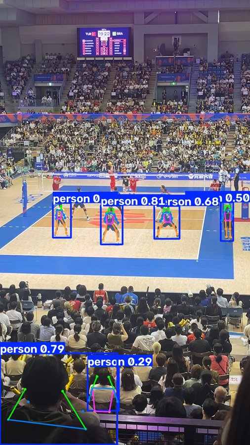
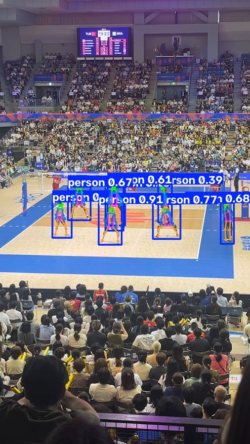
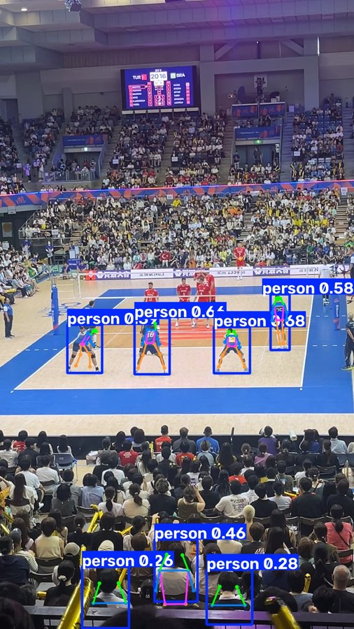
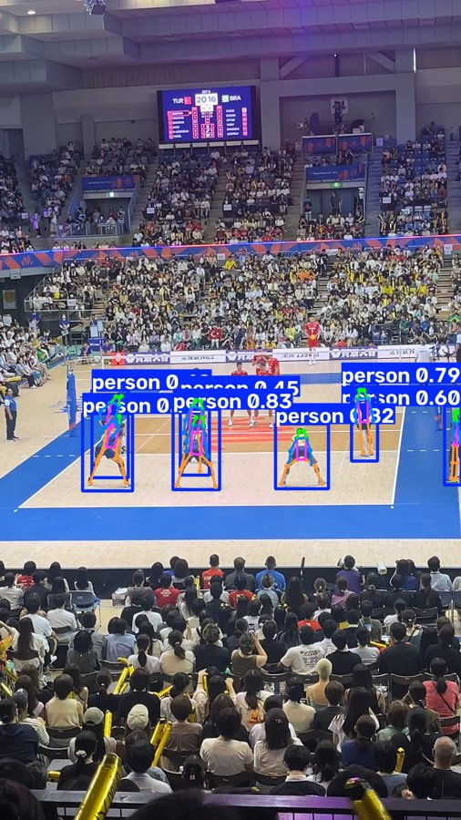
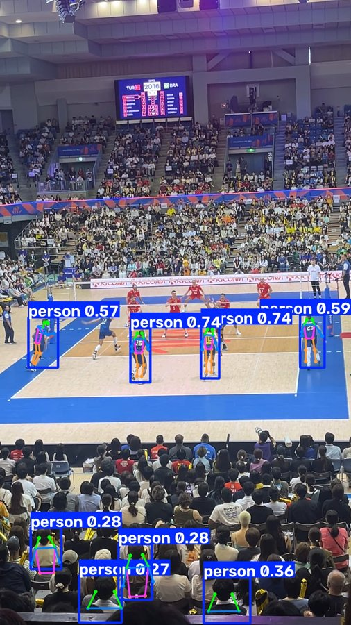
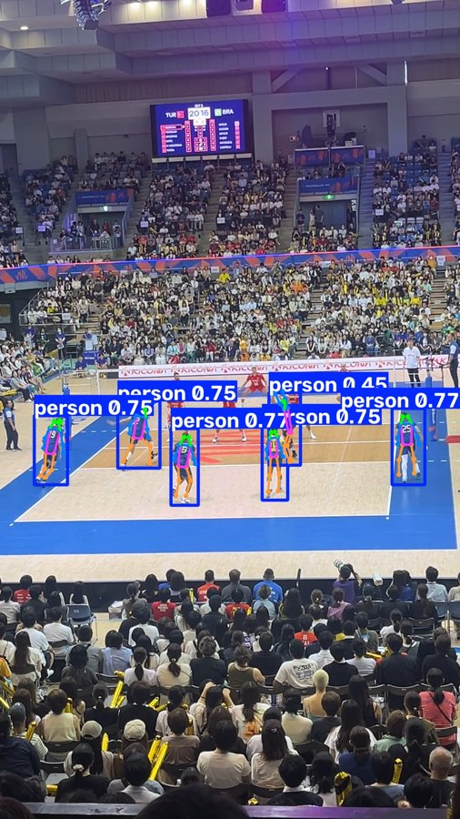
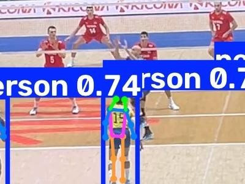
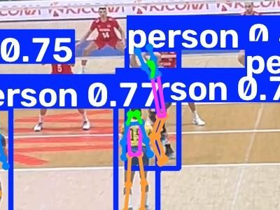

# player_skelton_detection

バレーボールの試合動画・画像から、コートに映っている選手全員の骨格（キーポイント）を検出するモデルを開発するプロジェクト。

Live demo: [pose_estimation_model_for_volleyball](https://huggingface.co/spaces/hats0902/pose_estimation_model_for_volleyball)

## 概要

近年、スポーツ分野で選手の骨格（keypoints）を活用した動作分析・戦術分析の研究が活発化している。バレーボールにおいても、選手の姿勢からプレーの種類やフォームを分析できれば、コーチングやパフォーマンス分析への応用が期待できる。

しかし、既存の汎用pose推定モデル（YOLO-Pose等）をバレーボールの試合映像にそのまま適用すると、選手を正しく検出できないケースが多く見られた。具体的には次の2つの課題があった。

1. **ジャンプして腕を大きく伸ばしている選手を検出できない**：バレーボールはジャンプしてトスを上げる・アタックを打つ・ブロックするといった、空中で腕を頭上に大きく伸ばす動作が頻繁に発生する。こうした一般的な人物姿勢推定モデルが学習していない特徴的な姿勢を、既存モデルは正しく認識できないことが多かった
2. **観客・審判・監督などコート外の人物を選手と誤検出する**：試合会場を撮影した映像には、コート上の選手だけでなく観客席の人物も大勢写り込む。既存モデルはこれらを選手と誤って検出することがあった

そこで本プロジェクトでは、試合映像から抽出した画像に対して選手全員のキーポイントを手動でアノテーションし、YOLO-Poseモデルをファインチューニングすることで、この2つの課題の改善を試みた。

## データセット作成

2025年開催の国際大会（VNL）の試合を実際に撮影した映像を使用した。試合映像からフレームを抽出し、コートに映っている選手全員（両チーム含む）を対象に、キーポイントとbboxを手動でアノテーションした。1画像に複数の選手が写るため、1枚の画像に対して複数人分のアノテーションが存在する。

アノテーションには**coco-annotator**を使用し、以下の17キーポイントをCOCO形式でアノテーションした。

* 鼻
* 左目・右目
* 左耳・右耳
* 左肩・右肩
* 左肘・右肘
* 左手首・右手首
* 左腰・右腰
* 左膝・右膝
* 左足首・右足首

データセットの規模は以下の通り。

| Dataset | images |
| --- | ---: |
| Total | 54 |
| Train | 37 |
| Validation | 6 |
| Test | 11 |

## ファインチューニング

ベースモデルには**`yolo26n-pose`**（Ultralytics製、YOLOシリーズの最新世代のpose推定モデル）を使用した。上記で作成したデータセットを用いて、Google Colab環境で200 epochのファインチューニングを実施した。

学習過程で得られた重みのうち、検証データに対する評価指標（bboxのmAP50-95とposeのmAP50-95の合計値）が最大となった、200エポック中154エポック目の重みを採用した。

## 性能改善：ファインチューニングによる変化

事前学習済み`yolo26n-pose`（ファインチューニングなし）をそのまま試合動画に適用したところ、上述の2つの課題（ジャンプ中の選手の検出漏れ、観客の誤検出）が実際に発生することを確認した。これに対し、ファインチューニング後のモデルでどう変わったかを、試合動画の同一フレームで比較した。

| ファインチューニング前 | ファインチューニング後 |
| --- | --- |
|  |  |
| 検出6件（コート上の選手4人＋観客2人） | 検出8件、すべてコート上の選手+監督（観客の誤検出なし） |

| ファインチューニング前 | ファインチューニング後 |
| --- | --- |
|  |  |
| 検出7件（コート上の選手4人＋観客3人） | 検出7件、すべてコート上の選手+監督（観客の誤検出なし） |

| ファインチューニング前 | ファインチューニング後 |
| --- | --- |
|  |  |
| 検出8件（コート上の選手4人＋観客4人）。**ネット際でジャンプしている選手は検出漏れ** | 検出6件、すべてコート上の選手（観客の誤検出なし）。**ジャンプしている選手も腕の骨格位置が間違っているものの検出には成功** |

3例目について、該当選手を拡大すると違いがより明確になる。

| ファインチューニング前（拡大） | ファインチューニング後（拡大） |
| --- | --- |
|  |  |

ファインチューニング前は、ネット際で腕を伸ばしてジャンプしている選手にbboxが全く付いていない（手前の選手のみ検出）。ファインチューニング後は同じ選手が骨格付きで検出されている。

いずれの例でも、選手の検出数は同等かそれ以上、観客の誤検出は減少しており、本プロジェクトが当初から課題としていた「ジャンプ中の選手の検出漏れ」「観客の誤検出」の両方について、改善が確認できた。

### 定量比較（同一動画・同一サンプリング条件）

試合動画から60フレームに1回サンプリングした87フレーム（confidenceしきい値0.25）で、ファインチューニング前後を比較した結果:

| 指標 | ファインチューニング前 | ファインチューニング後 |
| --- | --- | --- |
| 平均検出数/フレーム | 7.89 | 7.23 |
| 平均confidence | 0.497 | 0.630 |

<!-- ※ この集計では、フレームを間引いた状態でモデルのトラッキング機能を使うと検出数が不正確になることが分かったため、トラッキングは使わずフレームごとに独立して検出のみを行っている。 -->

検出数（観客誤検出を含む単純カウント）はファインチューニング後の方がやや少ないが、これは上記の画像比較で示した通り、観客の誤検出が減ったことによるものと考えられる。しかし審判や監督等の誤検出は残っているため、コート上の実際の選手数（多くの場面で6人前後）よりも多く検出されてしまっている。confidenceはファインチューニング後の方が一貫して高い。

### モデル自体の評価指標

採用した154エポック目の重みについて、mAP等の定量指標を2種類の分割で算出した。

| 指標 | Validation（6枚、学習中のエポック選定に使用） | Test（11枚、学習・エポック選定のいずれにも未使用） |
| --- | --- | --- |
| mAP50-95 (bbox) | 0.693 | 0.751 |
| mAP50-95 (pose) | 0.751 | 0.712 |
| precision (bbox) | 0.941 | 0.950 |
| recall (bbox) | 0.972 | 0.984 |
| precision (pose) | 0.963 | 0.950 |
| recall (pose) | 0.917 | 0.984 |

Test側もbbox・poseともmAP50-95が0.7を超えており、Validationと近い水準の精度が出ていることを確認した。

ただし11枚・63インスタンスという小規模なTestデータでの結果であり、試合映像全体を代表するものではない点には注意が必要（「今後の展望」参照）。

## 今後の展望

- before/afterの比較画像・定量比較は限られた枚数（目視4ペア＋同一動画87フレームの集計）に基づく予備的な確認である。Test分割（11枚）でのmAP算出は実施済みだが、これも小規模なデータであり、より多くの未知の試合映像に対する評価はまだ実施していない
- **観客・審判・監督等の誤検出は完全には解消していない**。「定量比較」の表の通り、ファインチューニング後も1フレームあたり平均7件以上検出されており、これは実際のコート上の選手数（多くの場面で6人前後）を上回る。上記の比較画像で示したフレームではたまたま観客の誤検出が0件になったが、他のフレームでは依然として観客・審判・監督等をコート上の選手と誤って検出することがある
- 選手をフレームをまたいで追跡するトラッキング機能（動画内で同一選手に同じIDを付与する機能）は、デモアプリ側で今後実装予定。ただし、フレームを大きく間引いた状態でトラッキング機能を使うと検出数が大幅に過小評価されることが分かっており、実装時は連続フレームでの動作を前提とし、間引き処理との組み合わせ方に注意が必要

## ドキュメント

- [`docs/product-requirements.md`](docs/product-requirements.md) — プロダクトビジョン、成功の定義
- [`docs/functional-design.md`](docs/functional-design.md) — システム構成、データモデル
- [`docs/architecture.md`](docs/architecture.md) — 技術スタック、技術的制約
- [`plan.md`](plan.md) — 次のイテレーションの計画

## ライセンス

本プロジェクトのファインチューニング・推論には[Ultralytics](https://github.com/ultralytics/ultralytics)（`yolo26n-pose`）を使用しており、UltralyticsはAGPL-3.0ライセンスである。AGPL-3.0はネットワーク経由でソフトウェアを利用可能にする場合（Webアプリとして公開する場合など）にも、対応するソースコードを利用者が入手できるようにすることを求める。

そのため本リポジトリも[AGPL-3.0](../LICENSE)の下で公開している。ファインチューニング済みモデルについても同様に、AGPL-3.0ライセンスのコードを用いて生成された成果物として扱う。

骨格検出のデモアプリ（Gradio）は[Hugging Face Space](https://huggingface.co/spaces/hats0902/pose_estimation_model_for_volleyball)で公開しており、そのソースコードも同Space上で公開している（AGPL-3.0）。
