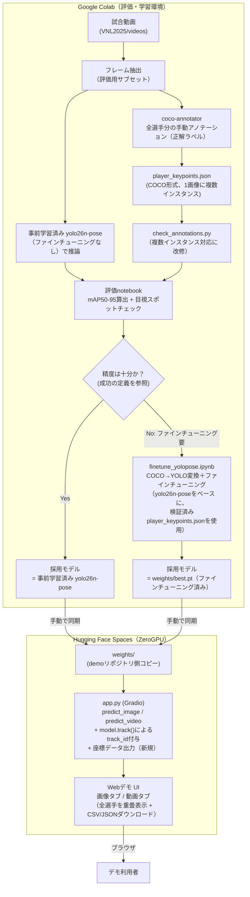
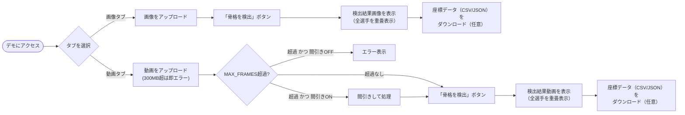

# 機能設計書

> **ドラフト**：内容の一部（評価データセットの規模など）は未確定。本文中に明記する。

## 機能ごとのアーキテクチャ

本プロジェクトは大きく3つの機能系統からなる。

1. **汎用モデル評価パイプライン**（このリポジトリ内、Google Colab上で実行）
   - 試合動画から評価用フレームを抽出し、全選手分のキーポイントを手動アノテーションして正解ラベルを作る
   - 事前学習済み`yolo26n-pose`（ファインチューニングなし）をそのまま適用し、目視評価と定量指標（mAP50-95等）で精度を把握する
   - 評価結果に基づき、ファインチューニングの要否を判断する（`docs/product-requirements.md`「成功の定義」参照）
2. **データセット作成・ファインチューニングパイプライン**（要否判断が「要」の場合のみ実行。このリポジトリ内、Colab上）
   - 前身`setter_skelton_detection`と同様の手順（COCO形式アノテーション→YOLO-pose形式変換→ファインチューニング）を、全選手を対象に行う
3. **推論デモアプリケーション**（別リポジトリ`pose_estimation_model_for_volleyball`、Hugging Face Spaces上でホスト。既存Spaceを転用）
   - 採用したモデル（事前学習済み、またはファインチューニング済み）を使い、ユーザーがアップロードした画像・動画に対して全選手の骨格を検出して返す
   - 検出結果（bbox・キーポイント座標、`model.track()`によるフレーム間`track_id`付き）をCSV/JSON形式でダウンロードできる機能を新規追加する

1と2はこのリポジトリ内で完結し、3とは`weights/`（採用したモデル重み）を介してのみ繋がる。前身と同様、コードとしては独立している。

## システム構成図



## データモデル定義

### `player_keypoints.json`（評価用・COCOフォーマット、新規作成）

前身`setter_keypoints.json`と同じCOCOスキーマ（`images` / `categories` / `annotations`）を踏襲するが、**1画像に対して`annotations`が複数（画像に写っている選手の人数分）存在する**点が異なる。

- `annotations[i]`: `bbox`、`keypoints`（17×3、COCO順）、`num_keypoints`は前身と同一定義
- `categories`: 単一カテゴリ（`person`）、`keypoints`名・`skeleton`定義も前身から流用可能
- ファインチューニングが必要と判断された場合、このファイルをそのまま学習用データセットの母体として拡張していく想定（前身の`setter_keypoints.json`と同じ運用）

### `check_annotations.py`の改修点（要否判断前に対応が必要）

前身の実装は「bbox数が1でない画像」を**アノテーションミスとして検出**する仕様（`setter_skelton_detection/CLAUDE.md`「Annotation validation」参照）。これはセッター1人限定だったための制約であり、本プロジェクトでは1画像に複数bboxが存在するのが正常なので、このチェックを「複数bboxを許容する」形に改修する必要がある。それ以外の検証（bboxの画像範囲外はみ出し、`num_keypoints`と実カウントの不一致）はそのまま流用できる。

### YOLO-pose学習用ラベル（ファインチューニングが必要な場合のみ）

前身と同一フォーマット（`kpt_shape: [17, 3]`、`flip_idx`も同じ）。1画像＝複数行（インスタンスごとに1行）になる点のみ異なる。ベースモデルは`yolo26n-pose.pt`（`yolo11n-pose.pt`から変更）。

### 検出結果エクスポート（CSV/JSON、新規）

`app.py`の推論結果をそのままダウンロード可能にする。`predict_video`は`model(frame)`ではなく`model.track(frame, persist=True)`を使い、動画を通して同一選手に同じ`track_id`を付与する（具体的なトラッカーの選定は`docs/architecture.md`「技術的制約と要件」参照）。

- **画像入力の場合**: `predict_image`は`model()`のまま変更しない（フレーム間の連続性がそもそも存在しないため`model.track()`化する意味がない）。したがって画像入力のJSON/CSVエクスポートには`track_id`が存在しない（`instance_id`＝検出順、のような形に留める。動画用の`track_id`とはフィールド自体が異なる点に注意）。
- **既知の限界（`track_id`の信頼性）**: バレーボールは同一チーム内の選手が同じユニフォームで見た目上区別しにくいことに加え、ブロック時の密集・接触が頻発するため、トラッカーの見た目照合（ReID）や動き予測だけでは**IDが入れ替わる（ID switch）ことがある**。`track_id`は「概ね同じ選手を指す目安」であり、完全な同一性の保証ではない、という前提をREADME等に明記する。

JSON例（動画入力、`track_id`付き）:

```json
[
  {
    "frame_index": 0,
    "detections": [
      {
        "track_id": 3,
        "bbox": [x, y, w, h],
        "keypoints": [
          {"name": "nose", "x": 123.4, "y": 56.7, "confidence": 0.98},
          "... 17キーポイント分"
        ]
      }
    ]
  }
]
```

JSON例（画像入力、`instance_id`のみ）:

```json
{
  "detections": [
    {
      "instance_id": 0,
      "bbox": [x, y, w, h],
      "keypoints": [
        {"name": "nose", "x": 123.4, "y": 56.7, "confidence": 0.98},
        "... 17キーポイント分"
      ]
    }
  ]
}
```

CSV: 動画は`frame_index, track_id, bbox_x, bbox_y, bbox_w, bbox_h, keypoint_name, x, y, confidence`、画像は`instance_id, bbox_x, bbox_y, bbox_w, bbox_h, keypoint_name, x, y, confidence`（`frame_index`列自体を持たない）の1行1キーポイント形式。列構成が画像・動画で異なる点に注意。

## コンポーネント設計

| コンポーネント | 役割 | 入力 | 出力 |
| --- | --- | --- | --- |
| フレーム抽出（notebook、新規） | 評価用フレームの抽出 | 試合動画 | 評価用フレーム画像 |
| coco-annotator | 全選手分の手動アノテーション | 評価用フレーム画像 | `player_keypoints.json` |
| `check_annotations.py`（改修） | アノテーションのバリデーション（複数bbox対応） | `player_keypoints.json` | 検証結果＋レポートCSV |
| 評価notebook（新規） | 事前学習済み`yolo26n-pose`の精度評価（mAP算出・可視化） | 事前学習済み`yolo26n-pose`、`player_keypoints.json` | 定量指標・目視確認用の可視化画像 |
| `finetune_yolopose.ipynb`（要否判断が「要」の場合のみ） | COCO→YOLO変換＋ファインチューニング（ベース: `yolo26n-pose`） | `player_keypoints.json` | `weights/best.pt` |
| `app.py`（demoリポジトリ） | Gradio UIと推論処理、座標データ出力 | 画像／動画ファイル | 骨格描画済み画像／動画、CSV/JSON |

`app.py`内の主要関数（前身から引き継ぐもの・新規のもの）:

- `predict_image(image)` — 既存実装のまま。`.plot()`は検出された全インスタンスを描画するため、多人数検出への変更コードは不要
- `predict_video(video_path, downsample)` — `model(frame)`を`model.track(frame, persist=True)`に変更（`persist=True`で動画内のフレームをまたいでトラッカーの内部状態を維持する）。それ以外（間引き処理・動画書き出し）は既存実装のまま
- 座標データ出力関数（新規） — 推論結果（`results[0].boxes` / `results[0].keypoints`）を上記JSON/CSVスキーマに変換し、`gr.File`でダウンロード可能にする。動画は`boxes.id`から`track_id`を取得するスキーマ、画像は`instance_id`（検出順）のスキーマと、入力種別で出力形式を分岐させる

## ユースケース図・画面遷移図

Gradio Blocksによる単一ページ・2タブ構成を維持し、各タブに座標データダウンロードを追加する。



ワイヤーフレームは作成しない（前身と同様、Gradio標準コンポーネントをそのまま使用するため、コード＝UI定義そのもの）。

## API設計

独自バックエンドAPIは持たない。前身と同様、Gradioが自動生成するAPIエンドポイントをそのまま利用する。

- `POST /gradio_api/upload` — ファイルアップロード（`max_file_size`超過時は413）
- `/predict_image`、`/predict_video`（`api_name`） — 各ボタンのクリックイベントに対応する推論エンドポイント
- 座標データダウンロード用の`gr.File`出力も、Gradioの自動エンドポイントに含まれる（追加のバックエンド実装は不要）

前身と同様、動作確認時は`gradio_client.Client.predict(..., api_name=...)`で直接叩いて検証する想定。
