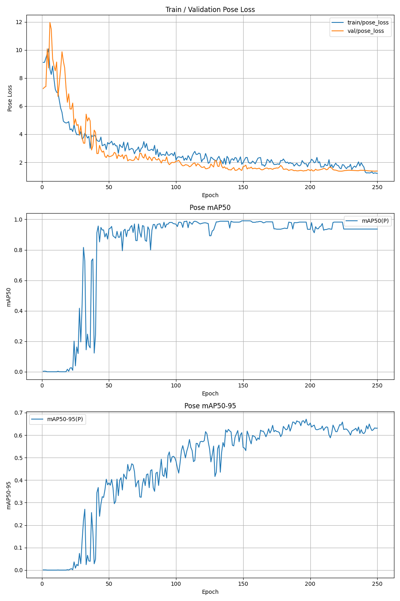

# セッター用骨格抽出モデルの開発

## 概要

当初、バレーボールにおけるセッターの骨格情報からトスの上がる位置を予測するモデルの開発を目的としていた。  
しかし既存のYOLO-Poseモデルを用いてセッターの骨格抽出を試したところ、十分な精度で骨格を抽出できないという課題があった。  
具体的には信頼度（confidence threshold）を `0.25` に設定した場合、12枚中5枚でしかセッターのbboxを正しく抽出できなかった。

セッターは、

* ジャンプしている
* 両腕を頭上に大きく伸ばしている
* 他の選手やネットなどによって身体の一部が隠れている・重なっている

といった特徴がある。そのため既存の人物姿勢推定モデルではセッターを正しく人物として認識し、keypoints を推定することが難しいのではないかと考えた。

そこで、YOLO-Poseモデルをセッターのデータセットを用いてファインチューニングし、セッターの特徴的な姿勢に対応した骨格抽出モデルを開発した。

---

# Steps

## 1. データセット作成

バレーボール、特に試合全体ではなく骨格抽出に活用できるような解像度の公開データセットは限られている。  
そこで2025年7月開催の国際大会の試合を実際に撮影し、独自にデータセットを作成した。

### 1.1. 撮影画像の前処理

撮影時には以下のような問題があった。

* 三脚の持ち込みが難しく手ブレが発生する
* 試合ごとに同じ座席から撮影できるとは限らないため、撮影位置によってカメラの画角が異なる

これらの影響を抑えるため、**アフィン変換**を用いて画像の位置合わせを行った。  
具体的には、バレーボールコートのネットの座標が各画像で同じ位置になるように画像を変換した。

これにより、撮影位置や画角の違いによる画像間の位置関係のばらつきを低減した。

### 1.2. フレームの選択

各画像について、セッターの手からボールが離れる直前のフレームを切り出した。  
これにより、トスを上げる直前のセッターの骨格情報を抽出することを目的とした。  
今回は3カ国4セッターの画像を対象とした。

### 1.3 アノテーションの作成

骨格情報のアノテーションには **coco-annotator** を使用した。

以下のキーポイントを手動でアノテーションした。

* 鼻
* 左目・右目
* 左耳・右耳
* 左肩・右肩
* 左肘・右肘
* 左手首・右手首
* 左腰・右腰
* 左膝・右膝
* 左足首・右足首

セッターは横向きになってトスを上げることが多く、身体の片側が隠れているケースが多かった。
そのため画像から確認できないキーポイントについては無理に推測せず、アノテーションを行わなかった。

作成したアノテーションをラベルデータとするため、事前学習で使用されているCOCO8-Poseのラベルに合わせた。

---

## 2. yolo11n-poseのファインチューニング

作成したセッター用データセットを使用し、**yolo11n-pose**ファインチューニングした。

データセットは以下のようにtrain/valに分割した。

| Dataset    | images |
| ---------- | ----: |
| Train      |   70 |
| Validation |   10 |
| Test |   20 |

Google Colab環境でultralyticsライブラリで250 epoch学習を実施。

---

# ソースコード

| Step          | Notebook                  |
| ------------- | ------------------------- |
| データセット作成      | [`making dataset.ipynb`](https://github.com/hats0902/volleyball_projects/blob/main/setter_skelton_detection/making%20dataset.ipynb  ) |
| ファインチューニング・評価 | [`finetune_yolopose.ipynb`](https://github.com/hats0902/volleyball_projects/blob/main/setter_skelton_detection/finetune_yolopose.ipynb) |

---

# 結果

## 学習曲線

以下に、学習時のlossおよび各種metricの推移を示す。  
最後の10epochほどはtrain < validationとなっており、lossも収束しているように見える。  
（epoch数を増やして結果を確認することも可能だが、画像数が100枚と少なめなため精度改善には枚数を増やすことの方が優先と考えた）

## 未知データに対する推論結果

未知データ20枚に対して推論を行い、目視で確認を行った。
* 19/20枚でセッターを認識できた
* Keypointについては以下の結果となった 

| 事象    | images |
| ---------- | ----: |
| 正しく抽出できている      |   13 |
| 大まかな骨格は合っているが一部のkeypointの検出が間違っている      |   1 |
| 大まかな骨格は合っているが一部のkeypointの検出が間違っている + 人が重なっている      |   2 |
| 大まかな骨格は合っているが一部のkeypointの検出が間違っている + 身体の向きが左以外      |   3 |
| 検出できていない      |   1 |

---

# 考察

今回の実験から、一般的な人物姿勢推定モデルをそのまま使用するのではなく、セッター特有の姿勢を含むデータセットでファインチューニングすることで、骨格抽出性能を改善できる可能性が示された。  
特に、セッターは「空中にいる」「腕を頭上に上げている」「身体の一部が隠れている」といった一般的な人物姿勢推定では扱いにくい特徴を持つ。そのため、セッターに特化したデータセットを用意することには一定の有効性があると考えられる。

# 今後の作業

一方で、まだ一部の画像ではkeypointの誤検出が発生している。

今後は、以下の改善が考えられる。

* 学習データ数の多様性増（身体の向きや選手の数）
* 2026年に最新モデル: YOLO26が発表されているためこちらも試す価値あり
* ファインチューニング時のパラメーター調節

最終的には、このモデルから得られたセッターの骨格情報を入力として、トスが上がる位置を予測するモデルの開発につなげることを目指す。
