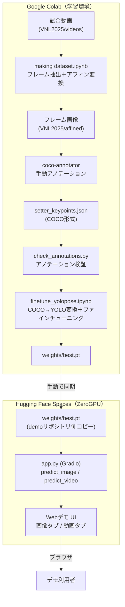
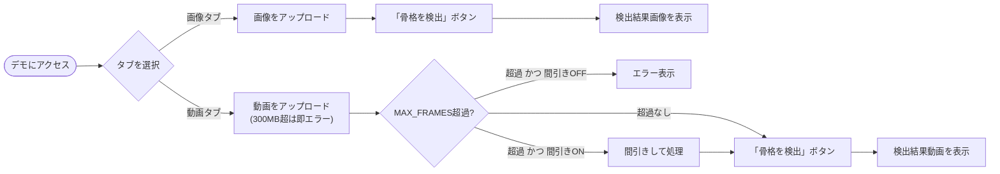

# 機能設計書

## 機能ごとのアーキテクチャ

本プロジェクトは大きく2つの機能系統からなる。

1. **データセット作成・ファインチューニングパイプライン**（このリポジトリ内、Google Colab上で実行）
   - 試合動画からセッターのトス瞬間フレームを抽出・正規化し、手動アノテーションを経てYOLO-poseをファインチューニングする
2. **推論デモアプリケーション**（別リポジトリ`pose_estimation_model_for_volleyball`、Hugging Face Spaces上でホスト）
   - ファインチューニング済みモデルを使い、ユーザーがアップロードした画像・動画に対してセッターの骨格を検出して返す

両者は`weights/best.pt`（ファインチューニング済みモデル重み）を介してのみ繋がっており、コードとしては独立している（`CLAUDE.md`「Live demo (separate repo)」参照）。

## システム構成図

## データモデル定義

### `setter_keypoints.json`（COCOフォーマット）

トップレベルに`images` / `categories` / `annotations`を持つ標準COCO形式。

- `images[i]`: `id`, `file_name`, `width`, `height`
- `annotations[i]`:
  - `bbox`: `[x, y, w, h]`
  - `keypoints`: 17×3のフラット配列（`x, y, v`の繰り返し）。COCO順（鼻・両目・両耳・両肩・両肘・両手首・両腰・両膝・両足首）
  - `num_keypoints`: `v > 0`のキーポイント数（`check_annotations.py`が実カウントと突合）
  - `v = 0`は「写っていないため意図的に未アノテーション」を意味し、ラベル漏れではない
- `categories`: 単一カテゴリ（`person`）、`keypoints`名と`skeleton`接続定義を含む

### YOLO-pose学習用ラベル（`.txt`、`finetune_yolopose.ipynb`が生成）

1行1インスタンス、スペース区切りで
`class cx cy w h` + 17×`(x, y, v)`（すべて0〜1に正規化）。
`dataset.yaml`側の対応する設定:

- `kpt_shape: [17, 3]`
- `flip_idx: [0,2,1,4,3,6,5,8,7,10,9,12,11,14,13,16,15]`（左右反転時のキーポイント対応）

### 検証レポート（`annotation_check_report.csv`）

`check_annotations.py`が出力する、アノテーションごとのキーポイント数の一覧（目視スポットチェック用）。

## コンポーネント設計

| コンポーネント | 役割 | 入力 | 出力 |
| --- | --- | --- | --- |
| `making dataset.ipynb` | フレーム抽出・アフィン変換 | 試合動画 | 正規化済みフレーム画像 |
| coco-annotator | 手動キーポイント・bboxアノテーション | フレーム画像 | `setter_keypoints.json` |
| `check_annotations.py` | アノテーションのバリデーション | `setter_keypoints.json` | 検証結果（標準出力）＋`annotation_check_report.csv` |
| `finetune_yolopose.ipynb` | COCO→YOLO変換＋ファインチューニング | `setter_keypoints.json` | `weights/best.pt`、学習曲線（`images/plot.png`） |
| `app.py`（demoリポジトリ） | Gradio UIと推論処理 | 画像／動画ファイル | 骨格描画済み画像／動画 |

`app.py`内の主要関数:

- `predict_image(image)` — 1枚の画像に対しモデル推論し、骨格を描画した画像を返す（RGB⇔BGR変換を内部で吸収）
- `predict_video(video_path, downsample)` — 動画をフレームごとに推論し、骨格描画後の動画（H.264）を返す。`MAX_FRAMES`超過時はエラーまたは間引き処理

## ユースケース図・画面遷移図

Gradio Blocksによる単一ページ・2タブ構成のため、画面遷移は発生しない。

ワイヤーフレームは作成していない（Gradioの標準コンポーネントをそのまま使用しているため、コード＝UI定義そのもの。`app.py`参照）。

## API設計

独自バックエンドAPIは持たない。Gradioが自動生成するAPIエンドポイント（`gradio_client`経由で呼び出し可能）をそのまま利用している。

- `POST /gradio_api/upload` — ファイルアップロード（`max_file_size`超過時は413）
- `/predict_image`、`/predict_video`（`api_name`） — 各ボタンのクリックイベントに対応する推論エンドポイント

これらは動作確認（画像・動画の実推論テスト）の際に`gradio_client.Client.predict(..., api_name=...)`で直接叩いて検証済み。
